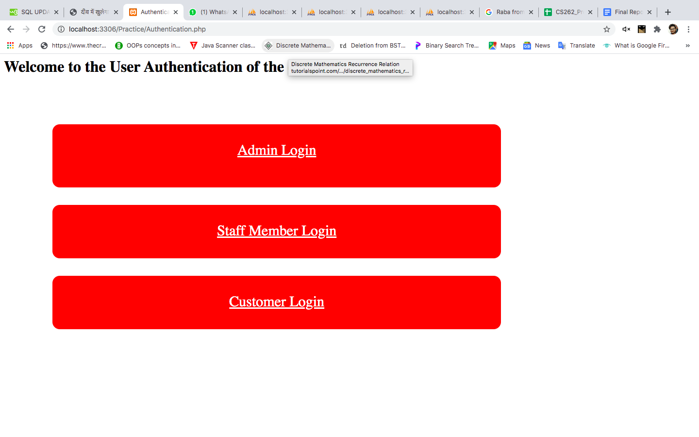
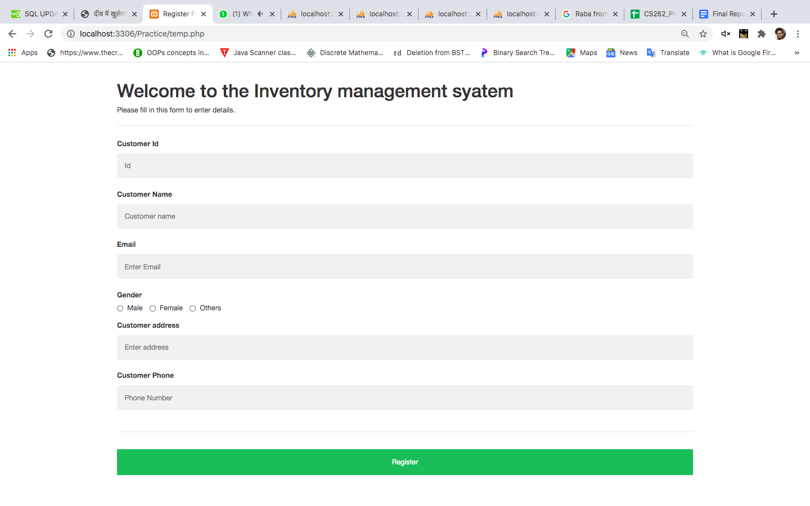
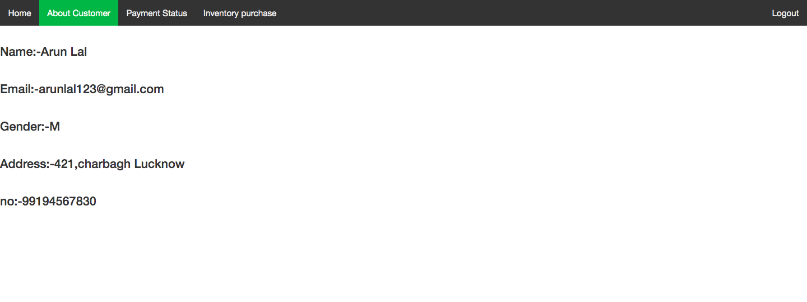
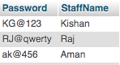
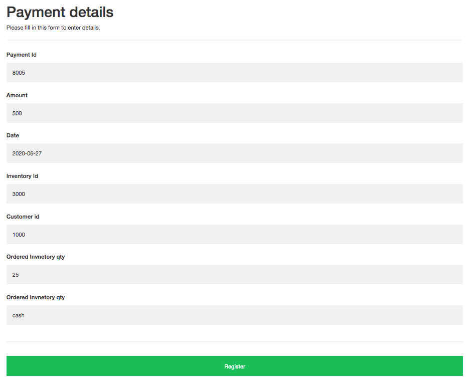
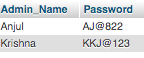
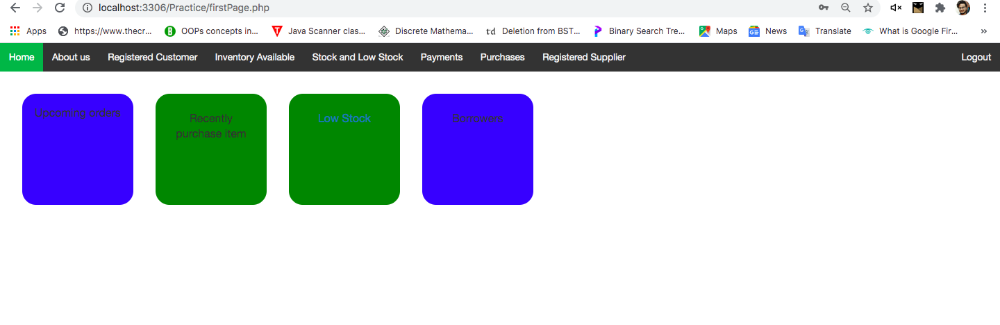
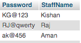
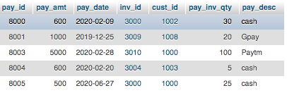
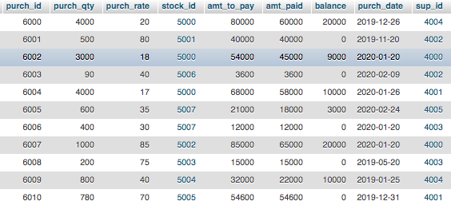

                                                

# INVENTORY CONTROL MANAGEMENT SYSTEM*

### April 17, 2020

## Description:

The inventory control management database system is documenting and managing the details of the inventories present in the industries/companies. It plays an important role in business to maintain all the details like stock, sales, profit and so on. It helps in effective management of raw materials and manufactured products so as to maximize profit and reduce expenditures. This will also result in more efficiency and less maintenance because we can easily find everything as related data is stored in an organized manner. Therefore, the inventory control management database is designed to reduce the storage cost, reduce the insurance cost, reduce taxes, and optimize the stock sales which are managed by the admin and staff.

In our project there are six modules in our Inventory management system project

- Customer Module
- Inventory Module
- Supplier Module
- Stock Module
- Payment Module
- Purchase Module

The Customer, Staff and Admin play a major role in accessing and updating the data. So modules can be explained on the basis of their privileges and authentication.

## Home Page

In the home page, Users have to login on the basis of their role in our inventory system. Users of the inventory can be one of Customer, Staff or admin. Assuming the user to be Customer we have the following: 

New customers first need to register themselves by going to sign up page so as to be able to view and purchase items from our inventory. Existing customers can login to the customer portal and can purchase and view the items available in stock to be sold.

Here we can see that a new user (as a Customer) has to enter their   information to create a new account and login to the Customer portal.

#### After logging in, the customer portal looks like this:

As we can see above, the customer portal welcomes you by using the Customer name which in this case is Arun Lal.

Here we can see that there are several entries given in the navigation menu.

The **About customer** section has the Customer information.

The **Payment Status** shows the recent payments made by the customer.

The **Inventory Available** shows the list of inventory in stock at present.

If the customer wants to purchase any inventory from the inventory list, they will request the staff and after completing the purchasing process,they will pay money to the staff. Staff will update the inventory data in the database.

The Customer may logout from the portal by clicking on the logout option on the top right corner of the page.

### Inventory table-

### Staff Login Page**

### Staff Details**

We have a staff Portal for the staff working in the company. A person can request the admin to get a job as staff in the company. Only registered staff have authorization to login, do transaction and update purchase and payment details made by the Supplier and customer respectively. 

The Payment insertion section is updated by the staff whenever a customer requests to buy something. The payment Id and other payment details are inserted after the staff makes a successful transaction which is requested by the customer. The inventory stock automatically gets reduced as soon as the payment process is complete.

As an instance we can see that Arun Lal requested an inventory having inv\_id = 3000 and the staff processed the transaction, which after successful completion is visible in the Payment Status of his account.

The Purchase insertion section is updated by the staff whenever the company requests materials from the supplier. The purchase Id and other purchase details are inserted after the staff makes a successful transaction between the company and the supplier. The inventory stock automatically gets updated as soon as the purchase process is complete.

The Payment Module stores history of transactions made by the staff for future reference.

The Staff can only view the Customer Module and Inventory Module where data of customer and inventory are present respectively. A staff is unauthorized to edit these details.

### Admin Login Page

The Admin Login page is for the admin to login to the inventory system. Admin has authorization to view and update details of all the users and available inventories in the system. Admin can login using local host also. 

Admin can also retrieve information of the balance amount to be paid. They will have information on the low stock items and can update them when required. They can also update details of inventory using this interface dynamically.

## Database Tables

**Admin Login**

**Staff Details**

**Customer Table**

**Inventory Table**

**Payment Table**

**Purchase Table**

**Stock Table**

**Supplier Table**

